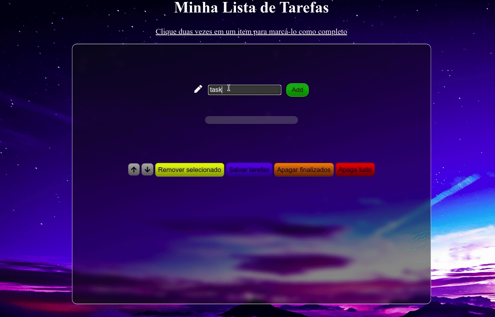
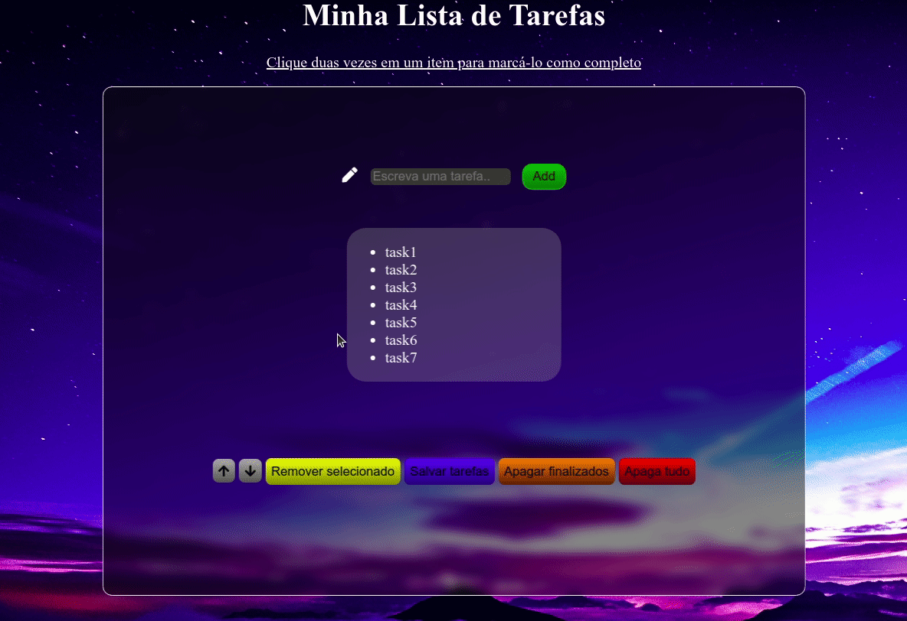

# Overview
## A Trybe study project that create, modifies and save elements list.

  
  

  

## :rocket: Technologies
This project was developed with the following technologies:   

- :heavy_check_mark: HTML
- :heavy_check_mark: CSS
- :heavy_check_mark: Javascript 
  

# About this project

The idea about this project is: 
> - Be able to add tasks on a unordered list. 
> - Be able to dblclick and mark an item as finished. 
> - Be able to manipulate items up and down.
> - Be able to delete all tasks.
> - Be able to delete only finished tasks.
> - Be able to save tasks on localstorage.
---
 

## Made with :purple_heart: by Patrick =)  

## Connect with me at [LinkedIn!](https://www.linkedin.com/in/patrick-morais/)